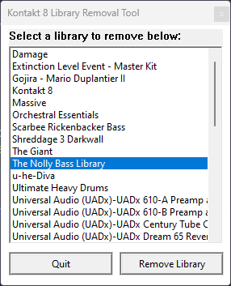

# Kontakt 8 Library Removal Tool (K8-LRT)

K8-LRT is a tool for removing libraries from the Bobdule version of Kontakt 8 (**Windows only**).



K8-LRT completely removes Kontakt libraries from the cache on disk. Native Instruments stores cache files in several different locations for some reason and this tool ensures they're all checked and removed.

Locations that need to be searched and deleted:

- `HKEY_LOCAL_MACHINE\SOFTWARE\Native Instruments\<Library Name>`
- `HKEY_LOCAL_MACHINE\SOFTWARE\WOW6432Node\Native Instruments\<Library Name>` (edge-case, still needs checked)
- `C:\Program Files\Common Files\Native Instruments\Service Center\<Library Name>.xml`
- `~\AppData\Local\Native Instruments\Kontakt 8\LibrariesCache\<filename>`
- `~\AppData\Local\Native Instruments\Kontakt 8\komplete.db3`

## Install

The latest version of K8-LRT is v0.3.0 - you can [download it here](https://github.com/jakerieger/K8-LRT/releases/latest).

## Changelog

### 1.0.0 (January 25, 2026)

The official 1.0 release of K8-LRT.

#### Added
- Update checking
- Log viewer
- Manually reload libraries

#### Changed
- Updated UI look to modern Windows

#### Fixed
- Memory leak constructing path strings
- Inconsistent naming
- Small bug fixes with file I/O

### 0.3.1 (January 23, 2026)

- Improved memory management model
- Added backups for cache files

### 0.3.0 (January 23, 2026)

- Sweeping code changes and refactoring
- Bug fixes and improvements
- Logging for debugging issues if any arise
- Library entry filtering to remove non-library entries
- More robust error handling

### 0.2.0 (January 23, 2026)

- Tons of bug fixes and improvements
- Added a `Remove All` button in place of the quit button
- Filter registry entries to remove non-library entries
- General code improvements

### 0.1.0 (January 22, 2026)

- Initial release of K8-LRT

## Building

K8-LRT is written in pure C using the Windows API. The entire program is just under 900 lines of code and the executable is only about 270 Kb. 

K8-LRT can be compiled via `nmake`, which is included with the MSVC toolchain. This requires the C++ Visual Studio toolsuite to be installed. If it is, you can simply run the build script from PowerShell to build K8-LRT:

```powershell
.\build.ps1 -Config debug # or release
```

## License

K8-LRT is licensed under the [Unlicense](LICENSE).