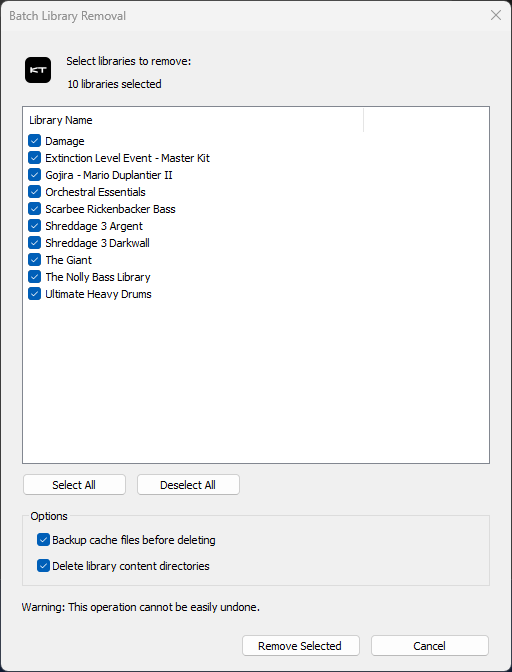
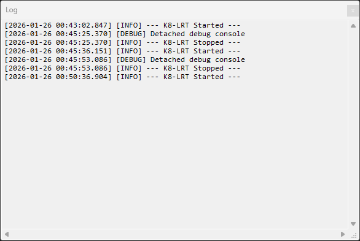

# Quickstart

This is a short guide going over how to use K8Tool. This guide assumes you've already downloaded K8Tool. If not, you can
head over to [releases](https://github.com/jakerieger/K8Tool/releases/latest) to download the latest version.

## Options

- **Backup cache files before deleting** - Whether or not `.bak` files should be created for files that will be
  removed (default: **YES**)
- **Delete library content directory** - Whether to delete the actual library content directory (default: **YES**)

## Removing a single library

In order to remove a single library, select it from the list and click "Remove Selected" at the bottom right of the
window. A new window should appear that looks like this:

Confirm the removal by clicking "Remove Library", or cancel and close the window.

## Removing multiple libraries

K8Tool also allows you to remove multiple libraries at the same time. Click "Remove All" at the bottom left of the
window. A new window should appear that looks like this:

Here you can select which libraries you'd like to remove. Confirm your selection and options are correct and click "
Remove Selected" to remove them.

## Logs

K8Tool logs all of its actions to a log file for aid in debugging problems. The current log can be viewed from within
K8Tool by going to `Menu->View Log`.

## Checking for Updates

You can check for updates by going to `Menu->Check for Updates`.

## (Coming Soon) Relocating Libraries